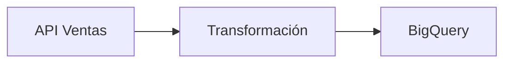

# docpipe

CLI que analiza pipelines de datos (dbt, Airflow, Prefect, Python) y genera documentación automática en español, guardándola directamente en tu vault de Obsidian.

## Cómo funciona

```
docpipe generate <ruta_pipeline> [opciones]
       ↓
  Detecta tipo (dbt / airflow / prefect / python)
       ↓
  Parsea el código (AST, YAML)
       ↓
  Llama a Gemini via Vertex AI
       ↓
  Escribe .md en tu vault de Obsidian
```

## Instalación

**Requisitos:** Python 3.10+, gcloud CLI autenticado con ADC.

```bash
git clone https://github.com/eliezer-afk/Doc-pipeline.git
cd Doc-pipeline
pip install -e .
```

## Configuración

```bash
docpipe config init
```

O creá `.docpipe.yaml` en tu home o en el directorio del proyecto:

```yaml
vault:
  path: "D:/tu-vault/Obsidian"
  pipelines_folder: "Pipelines"

vertex:
  project_id: "tu-proyecto-gcp"
  region: "us-central1"
  model: "gemini-2.5-pro"

defaults:
  owner: "tu-nombre"
  tags:
    - pipeline
    - data
  language: "es"
```

> **Importante:** `.docpipe.yaml` está en `.gitignore`. Nunca subas este archivo al repo ya que contiene datos de tu proyecto GCP.

## Uso

```bash
# Genera documentación y la escribe en el vault
docpipe generate ./mi_pipeline/

# Previsualiza sin escribir al vault
docpipe generate ./dags/ventas.py --dry-run

# Especifica subcarpeta dentro del vault
docpipe generate ./dbt/models/ --folder "Clientes/Acme"

# Abre el archivo en Obsidian al terminar
docpipe generate ./scripts/etl.py --open
```

## Tipos de pipeline soportados

| Tipo | Detecta automáticamente | Extrae |
|------|------------------------|--------|
| **dbt** | `dbt_project.yml` en la carpeta | Models, sources, columnas, tests |
| **Airflow** | `from airflow` o `DAG(` en el archivo | DAG id, schedule, tasks, dependencias |
| **Prefect** | `@flow` o `from prefect` | Flows, tasks decoradas |
| **Python** | Cualquier `.py` sin framework | Funciones, imports, clases, docstrings |

## Formato del archivo generado

Cada pipeline genera un `.md` con frontmatter YAML compatible con Obsidian:

```markdown
---
pipeline: ventas_diarias
type: airflow
owner: Eliezer
tags: ["pipeline", "data", "airflow"]
created: 2026-05-26
updated: 2026-05-26
status: active
---

# ventas_diarias

## Resumen
...

## Arquitectura


## Fuentes de Datos
## Transformaciones
## Destino
## Schedule
## Checks de Calidad
## Pipelines Relacionados
## Notas
```

Si el archivo ya existe, `created` se preserva y solo se actualiza `updated` y el contenido.

## Gestión de configuración

```bash
docpipe config show              # Ver config actual
docpipe config set vault.path "D:/nuevo/path"
docpipe config set vertex.project_id "otro-proyecto"
```

## Tests

```bash
pip install -e ".[dev]"
python -m pytest tests/ -v
```

## Stack

- [Typer](https://typer.tiangolo.com/) — CLI
- [google-genai](https://googleapis.github.io/python-genai/) — Gemini via Vertex AI
- [Jinja2](https://jinja.palletsprojects.com/) — Templates markdown
- [PyYAML](https://pyyaml.org/) — Parsing de dbt y configuración
- [Rich](https://rich.readthedocs.io/) — Output en terminal
